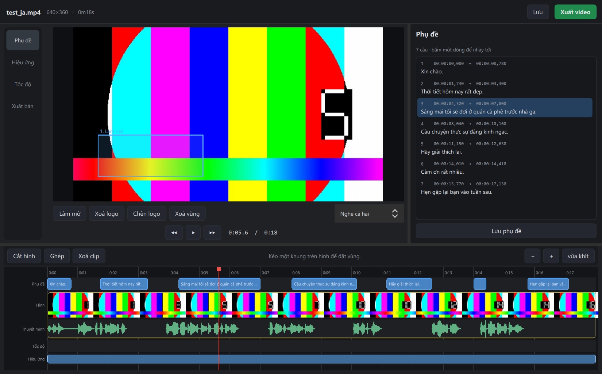
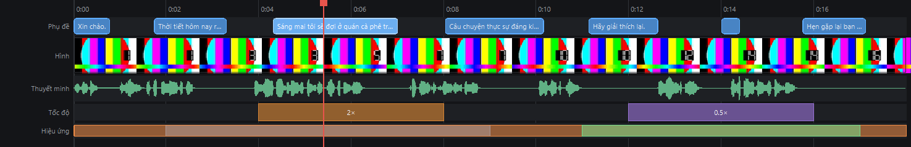
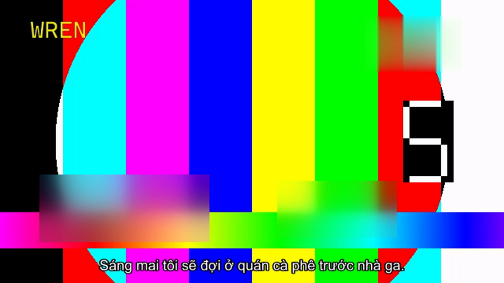

# WrenAutoDub

Thuyết minh tự động phim nước ngoài sang tiếng Việt, chạy hoàn toàn trên máy bạn.

Đưa vào một file phim, nhận về bản có giọng đọc tiếng Việt khớp từng câu thoại,
phụ đề đã dịch, và tiếng gốc vẫn nghe được phía dưới. Không upload phim đi đâu,
không tài khoản, không hạn mức.

Whisper tự nhận ngôn ngữ nguồn — đã chạy thật với tiếng Nhật và tiếng Trung.



## Nó khác gì các trình dựng khác

Hầu hết công cụ dựng phim mã nguồn mở đang cố làm lại CapCut. WrenAutoDub không
cạnh tranh ở đó — nó làm một việc mà không công cụ nào khác làm:

**Ép giọng đọc vừa khít khung thời gian của từng câu phụ đề.** Câu tiếng Việt
thường dài hơn câu gốc. Thay vì để giọng đọc tràn sang câu sau, nó
tăng tốc từng câu bằng `rubberband` (giữ nguyên cao độ, không bị the thé), cắt
khoảng lặng đầu file, và đặt đúng vào mốc thời gian. Đo được: lệch **0.03 giây**
so với mốc phụ đề.

Đó là khác biệt giữa "có đọc" và "nghe được".

## Chạy trên máy yếu

Toàn bộ chuỗi chạy local. Số đo thật trên **GTX 1650 Ti 4GB**:

| Model | Đỉnh VRAM | Tốc độ |
|---|---|---|
| `medium` | 1215 MiB / 4096 | 5.8× realtime |
| `large-v3` | 2281 MiB / 4096 | 3.7× realtime |

`large-v3` vừa thoải mái trên card 4GB nên để làm mặc định. Giọng đọc VieNeu-TTS
chạy ONNX trên **CPU**, không tranh VRAM với Whisper — hai phần chạy song song
được.

## Bắt đầu

```bash
python wren.py doctor          # kiểm ffmpeg, CUDA, model, mạng
python wren.py run "phim.mkv"  # chạy cả 4 bước
```

Ra `phim.vi.mkv`: track thuyết minh tiếng Việt + track tiếng gốc + phụ đề Việt
nhúng sẵn. Model thiếu tự tải, có kiểm dung lượng đĩa trước.

Dừng giữa chừng thoải mái — mọi bước ghi kết quả ra `phim_work/` và bỏ qua nếu
đã có. Phim 2 tiếng đứt mạng lúc đang đọc, chạy lại là đi tiếp từ câu dở.

## Chuỗi 4 bước

| Bước | Làm gì | Bằng gì |
|---|---|---|
| 1 | nhận dạng tiếng nói → `ja.srt` | faster-whisper (CUDA int8_float16) |
| 2 | dịch → `vi.srt` | Google Translate |
| 3 | đọc + ép timing → `dub.wav` | VieNeu-TTS + rubberband |
| 4 | trộn và ghép vào video | ffmpeg |

Chạy lẻ từng bước được. Hay dùng nhất: sửa tay `vi.srt` rồi chạy lại từ bước 3.

## Trình dựng



Dòng thời gian 5 lớp: chip phụ đề có chữ, ảnh khung hình thật, sóng âm của giọng
đọc, đoạn đổi tốc độ, vùng hiệu ứng. Cả ba lớp trên đều kéo thả được, có bắt dính
vào đầu đọc và mốc của phần tử khác.

- **Cắt / ghép clip**, hai chế độ: hít sát nhau, hoặc để rời rạc chèn màn đen
- **Đổi tốc độ từng đoạn** 0.1–8×, có preset đường cong. Phụ đề và giọng đọc tự
  dồn theo
- **Làm mờ vùng, xoá logo, chèn logo** — kéo khung ngay trên hình
- **Dời khớp tiếng** khi giọng đọc lệch đều so với miệng nhân vật
- **Xuất bản** 480/720/1080p, kèm ước tính dung lượng và cảnh báo cắm sạc



*Một khung hình xuất thật: logo chèn, vùng xoá logo, hai vùng làm mờ, phụ đề
nung, đã scale xuống 720p.*

## Bàn giao cho trình dựng khác

Không muốn dựng trong app này cũng được:

```bash
python wren.py handoff "phim.mkv"
```

Gom `vi.srt` và `dub.wav` vào một thư mục kèm hướng dẫn có sẵn thông số thật, kéo
thẳng vào CapCut / Premiere / DaVinci.

## Yêu cầu

Python 3.9+, ffmpeg có `rubberband` trong PATH, và:

```
faster-whisper ctranslate2 deep-translator soundfile numpy huggingface-hub
nvidia-cublas-cu12 nvidia-cudnn-cu12 PyQt6 vieneu
```

Chạy `python wren.py doctor` để kiểm hết một lượt — nó bắt luôn mấy lỗi hay nổ
giữa chừng như thiếu DLL CUDA hay ffmpeg không có filter cần thiết.

## Tình trạng

Đang phát triển. Hai giao diện chạy song song.

Bản QML đi theo ba màn hình nối tiếp — **Mở → Đang chạy → Dựng** — phản ánh
đúng bản chất sản phẩm: một dây chuyền thuyết minh có kèm chỗ sửa, không phải
một trình dựng đa dụng. Màn hình giữa theo dõi cả bốn bước: thẻ đã xong gập
lại một dòng, thẻ đang chạy nở ra kèm thanh tiến độ riêng, và báo luôn số câu
bị ép quá tay để biết còn bao nhiêu việc phải sửa.

```bash
python wren.py edit --qml          # mở màn hình chọn phim
```

Bản PyQt6 Widgets đầy đủ tính năng hơn ở phần dựng (hiệu ứng, đổi tốc độ).

Chưa có: fade, keyframe âm lượng, transition giữa clip.

Đã kiểm với mkv h264/hevc kèm aac, ac3, e-ac3, dts, flac — 8/8 phát trực tiếp
được.

Đã chạy trọn chuỗi trên một phim thật 15 phút 21 giây (tiếng Trung, 154 câu):
toàn bộ hết **4,4 phút**, riêng bước nhận dạng 1,4 phút. Bản ra đã kiểm bằng
nội dung chứ không chỉ thời lượng — giọng đọc nổ đúng mốc phụ đề, tiếng gốc
chạy liền tới phút cuối.

Phim đó thiếu mất 3 phút 18 giây âm thanh do tải hụt segment HLS. Công cụ giữ
nguyên trục thời gian và để đoạn đó im lặng, thay vì dồn hai mép lỗ lại làm
mọi câu thoại phía sau lệch sớm đúng 3 phút 18 giây. Nếu vì lý do nào khác mà
audio tách ra vẫn không dài bằng phim, bước 1 dừng và nói rõ lệch bao nhiêu
chứ không chạy tiếp để cho ra bản hỏng.

## Giấy phép

[GNU AGPL-3.0](LICENSE).

Bạn được tự do dùng, sửa và phân phối lại. Điều kiện: bản sửa đổi cũng phải mở
nguồn theo cùng giấy phép — kể cả khi bạn chỉ cho người khác dùng qua mạng chứ
không phát hành file. Đó là điểm khác giữa AGPL và GPL thường.
